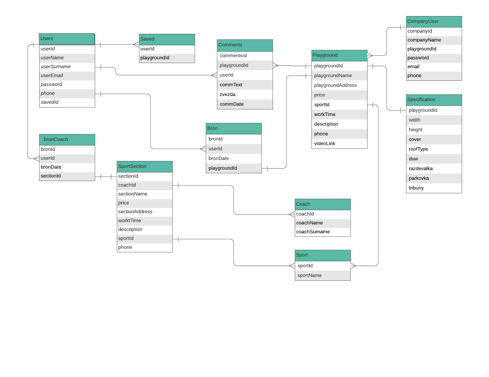
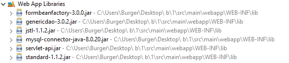
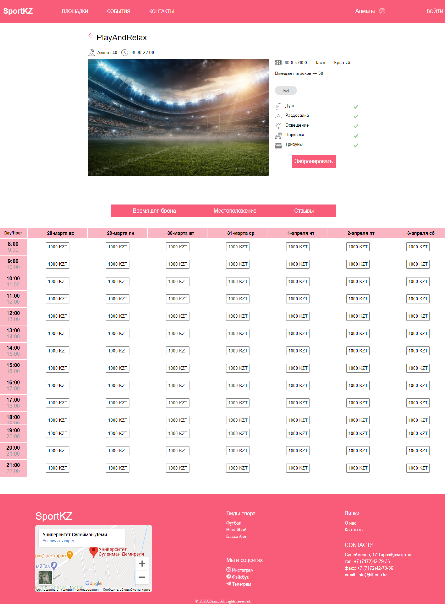
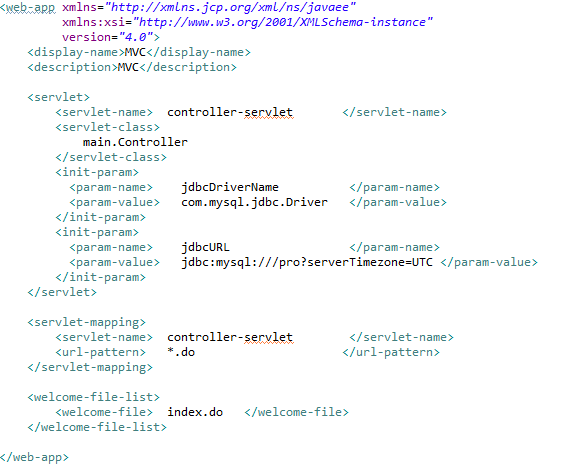

<h1 align="center">  </h1>

<h2 align="center"> <a href="#"> Link </a> </h2>

## About Project

#### Opportunities

- A person can book a sports playgrounds online at a certain hour

- User-friendly, intuitive, flexible table

- Save people's time and resources

- Sports sections for self-development

- Fast online booking, no calls required

 

#### Functional

- Two main sections 
  1. Playgrounds
  2. Sports sections

- The map on which the object is marked, you can calculate the distance from you

- In the table by clicking on the button you can book a convenient time for you

- You can comment and give an assessment

- Clear, concise information about the object , such as "whether there is a shower, parking, etc"

- Booking by captcha and confirmation by SMS code

 

#### Platform

We chose web user interface.Building a web browser interface means that any customer on any combination of hardware and operating system can access and maximize their use of your software. If you implement a web browser UI, you can rest assured that your customers will be able to utilize your solution in diverse circumstances.
In the future, if the project is successful, we want to do it on android and ios.

<h2 align="center">  </h2>

 

#### Technology

We wrote the backend only in php. We want something new and decided that we would write in JavaEE.Why JavaEE,not php? While comparing the Java vs PHP performance, Java is clearly a winner as it is faster and efficient than PHP to write applications.To database we chose MySQL.Why MySQL?MySQL comes with the advantage of unmatched flexibility that facilitates efficient management of deeply embedded applications, even in gigantic data centers that stack tremendous amounts of mission-critical information.

## Project Use-Case diagram and questions over the data

### General questions:
   &nbsp;&nbsp;&nbsp;1.Can a customer leave a review and see reviews from other users?(relation between user,playground comments) 
   &nbsp;&nbsp;&nbsp;2.Will the site be able to provide information about the object about its comfort of additional services?(relation playground between specifications) 
   &nbsp;&nbsp;&nbsp;3.Will the client be able to safely and quickly use the playground at a specific time?(relation between user,playground,bronPlayground) 
   &nbsp;&nbsp;&nbsp;4.Can company's user quickly add objects and change its information?(relation between companyUser and playground/sportSection) 
   &nbsp;&nbsp;&nbsp;5.Is it possible to enroll in the desired coach?(relation between bronCoach,sportSection,coach) 
   &nbsp;&nbsp;&nbsp;6.Is it possible to search sport playgrounds  by category?(relation between sport,playground,sportsection) 
   &nbsp;&nbsp;&nbsp;7.Can a client save their favorite sites to favorites? (Relation between user, saved, playground) 
   &nbsp;&nbsp;&nbsp;8.Is it possible to see the rental of inverters in the site? 
   &nbsp;&nbsp;&nbsp;9.Can a client search for sports grounds at an affordable price? 
   &nbsp;&nbsp;&nbsp;10.Can the client find the nearest sport playground? 
   &nbsp;&nbsp;&nbsp;11.How is confirmation done? 
   &nbsp;&nbsp;&nbsp;12.Where can I contact if my reservation is not fulfilled? 
   &nbsp;&nbsp;&nbsp;13.Can I see the working hours of the sport playgrounds? 
   &nbsp;&nbsp;&nbsp;14.Is it possible to find the best rated sport playground? 
   &nbsp;&nbsp;&nbsp;15.Will the company providing the platform be able to add a video review? 
 
  
 
 ### UML diagram:
   
 
 ### Dataset for the project:
 &nbsp;&nbsp;&nbsp;https://docs.google.com/spreadsheets/d/1qF9-MWIKyzAC7-g0pHNyzp1sHV_JRet9VzpiMORbUsE/edit#gid=2085233290
 

## Data modeling and database design

#### E/R diagram
<h1 align="center">  </h1>

#### DDL-queries and DML-queries
&nbsp;&nbsp;&nbsp;&nbsp;&nbsp;&nbsp;DDL and DML queries stored in the "data" folder.

## SQL queries 
SQL queries based on the aforementioned 15 questions and based on the chosen database stored in the "query" folder.

## User-interface implementation and connection
#### Creating a project
To create a project, we need " Eclipse Idea” to create a Java EE project
Download Tomcat to run the project in the server.

And download other components: JDBS <h1 align="center">  </h1>

#### Frontend
We used delicate colors so that the client would rest when choosing and not think about the little things like:is there parking, shower, etc. Made the
most of the Gestalt laws.For example: Grouping, closeness, icons.
<h1 align="center">  </h1>

#### Connect with database
We give the information in the configuration file web.xml
We use for database server Mysql

<h1 align="center">  </h1>

## Relational Algebra operators RA linear expression and its RA tree
RA linear expression and its RA tree for 7 queries stored in the <a href="https://github.com/Damir2307/DB3_project/tree/main/RA">RA</a> folder.

## Calculating true cardinalities and plan evaluation
All txt files stored in the <a href="https://github.com/Damir2307/DB3_project/tree/main/TC_PE">TC_PE</a> folder
 
## Query speed
All txt files stored in the <a href="https://github.com/Damir2307/DB3_project/tree/main/data/speed">data/speed</a> folder
